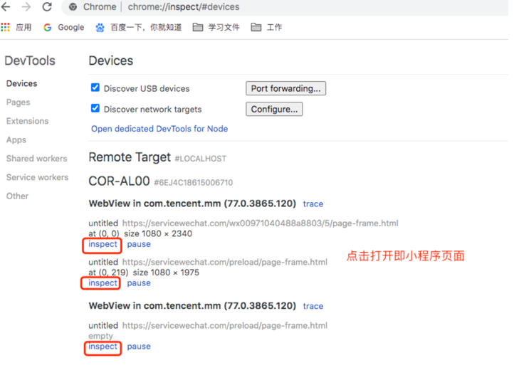
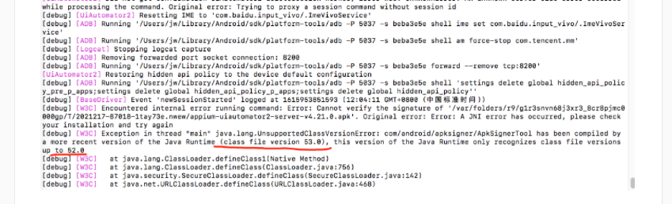
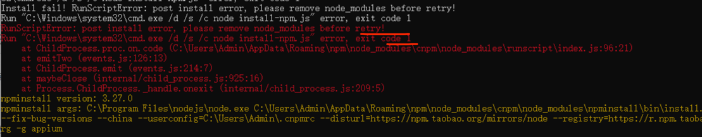
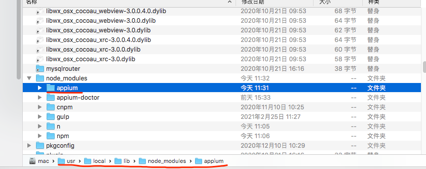

# Appium-Applet-UI

## 介绍

适用于微信小程序UI自动化

## 软件架构

本项目使用Python3+Appium完成，基于PageObject模型进行测试代码编程的UI自动化测试框架。

## 安装教程

本项目使用的软件配置如下：

1. java version "1.8.0_241" jdk版本1.8
2. androidSDK Android Debug Bridge version 1.0.41
3. appium 服务端版本 1.18.2 依赖于node.js(Windows可用appium客户端)
4. Appium-Python-Client 第三方包 pip install -r requirements.txt
5. python3 执行环境

## 前期准备

1. 环境搭建可参考<https://www.cnblogs.com/zenghongfei/p/11592661.html>
2. 元素定位工具：Android Sdk包中的 uiautomateviewer 和 Appium Desktop 中的 Appium Inspector
   解决uiautomatorviewer中添加xpath的方法:<https://www.cnblogs.com/kaibindirver/p/8158280.html>
   安卓查看APP界面元素 直接用上述两种工具定位元素
3. 操作微信小程序webview,需要webview调试功能
    - 在微信窗口输入：debugtbs.qq.com，点开，提示需要设置forcex5为true
    - 根据提示你再输入一个：debugmm.qq.com/?forcex5=true，点开，提示：
    - 然后再回去点：debugtbs.qq.com 这个链接就发现打开的页面不一样了，出来tbs调试页，点击：“安装线上内核”按钮，安装完成后，再回去点击：debugx5.qq.com这个链接，就发现可以出来X5调试页面了
    - 电脑chrome浏览器地址栏输入：chrome://inspect/#devices
      
4. 查看程序webview元素信息出现空白或者打不开，直接在Google上查看需要外网，可参考以下解决方案。 地址：<https://www.cnblogs.com/slmk/p/9832081.html>

## 安装常见问题

依赖版本过高：

Mac不要使用sudo安装，直接使用用户权限安装appium
若安装提示错误如下：

Mac下删除appium文件夹，再重新安装。(win暂时未知)

设置淘宝源
1.npm install -g cnpm --registry=<http://registry.taobao.org>

安装appium
2.cnpm install -g appium@1.18.2

卸载appium
3.cnpm uninstall -g appium

## 项目结构

├── README.md                   // help  
├── appium_ui_01.py             // 演示demo  
├── business                    // 处理业务模块  
├── configs                     // 基础配置  
├── element_pages               // 定位页面元素  
├── handle                      // 元素操作模块  
├── libs                        // 第三方包  
├── locators                    // 元素定位表达式  
├── logs                        // 日志和错误信息  
├── requirements.txt            // 安装依赖  
├── run.py                      // 主入口执行文件  
├── test_cases                  // 测试用例  
├── test_datas                  // 测试数据  
├── test_reports                // 测试报告  
└── tools                       // 自定义共用方法  
